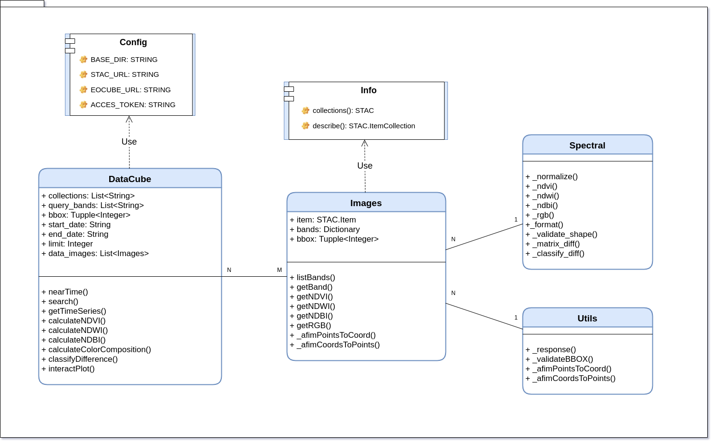
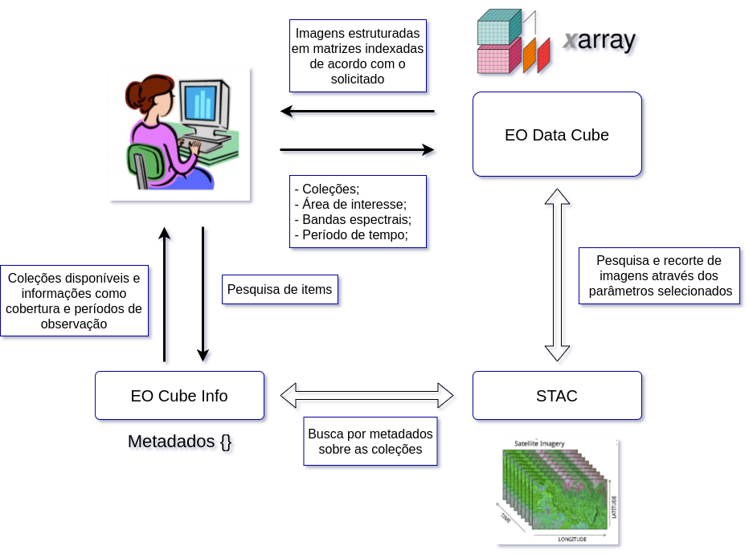

..
    This file is part of Python Client Library for Earth Observation Data Cube.
    Copyright (C) 2021 None.

    Python Client Library for Earth Observation Data Cube is free software;
    You can redistribute it and/or modify it under the terms of the MIT License;
    See LICENSE file for more details.

==================
API - EO Data Cube
==================

.. image:: https://img.shields.io/badge/license-MIT-green
        :target: https://github.com/brazil-data-cube/wtss/blob/master/LICENSE
        :alt: Software License

.. image:: https://img.shields.io/badge/miniconda-3-green
        :target: https://docs.conda.io/en/latest/miniconda.html
        :alt: Miniconda

.. image:: https://img.shields.io/badge/python-3.8-green
        :target: https://www.python.org/
        :alt: Python

.. image:: https://img.shields.io/badge/stac.py-0.9-green
        :target: https://github.com/brazil-data-cube/stac.py
        :alt: stac

.. image:: https://img.shields.io/badge/Dask-2021.6.0-green
        :target: https://pypi.org/project/dask/
        :alt: Dask

Identificação
=============

 - **Programa:** Programa de Pós-Graduação em Computação Aplicada;
 - **Disciplina:** CAP-419 Introdução à Programação com Dados Geoespaciais;
 - **Professores:** Gilberto Queiroz e Thales Korting;
 - **Alunos:** Abner Ernâni dos Anjos, Baggio Luiz de Castro e Silva e Marcelly Homem Coelho.

Sobre
=====

Os avanços tecnológicos na área espacial possibilitaram o desenvolvimento de sensores remotos embarcados em satélites para gerar grandes volumes de dados de observação da Terra. Esta realidade fomentou o aparecimento de novos métodos para categorizar as imagens de satélites com base no tempo e na localização. Este trabalho apresenta o desenvolvimento de um pacote em *Python* com o objetivo de gerar cubos de dados baseados no tempo e na localização das images por meio do sistema de catalogação *SpatioTemporal Asset Catalog - STAC* do projeto *Brazil Data Cube - BDC*. A contribuição da pesquisa é disponibilizar à comunidade científica uma ferramenta que facilite o acesso aos dados de observação da Terra.

Contextualização
================

Os avanços tecnológicos espaciais possibilitaram o desenvolvimento de sensores remotos embarcados em satélites de observação da Terra, os quais constituem importante fonte de aquisição de imagens da superfície terrestre. De acordo com [Vogt et al. 2019], devido às possibilidades geradas pelas novas tecnologias e pela grande quantidade de dados espaço-temporais coletados, o domínio da geoinformática tem se desenvolvido muito nos últimos anos. 

O sensoriamento remoto define um conjunto de técnicas para a medida de propriedades da superfície terrestre a partir de satélites e aeronaves controlados remotamente. Com essa extração de dados da superfície terrestre classificados de acordo com um objetivo específico, as imagens de alta resolução baseadas em espectros visíveis e não visíveis são extraídas e auxiliam na identificação de propriedades importantes para as análises descritas no presente trabalho.

As aplicações estão variadas dentre monitoramento de espaços geográficos, análise de mudanças climáticas, mapeamento de reservas de minérios, meteorologia e reconhecimento para áreas militares. Com o surgimento e crescimento dessas aplicações o sensoriamento remoto necessita de sistemas para a visualização dos dados em uma forma significativa.

O imageamento da superfície terrestre por meio do sensoriamento remoto possibilita acessos a diferentes fontes de dados e, assim, tem proporcionado o desenvolvimento de novos produtos e serviços para a comunidade científica. Segundo [Zaglia et al. 2019], a utilização de técnicas que organizam as imagens de satélites em forma de cubos de dados tem se mostrado fundamental.

O projeto *Brazil Data Cube* (BDC) consiste em uma ideia centralizada na geração de cubos de dados para todo o território brasileiro. O projeto está sendo desenvolvido por pesquisadores do Instituto Nacional de Pesquisas Espaciais (INPE).

A organização em cubos de dados multidimensionais para o território brasileiro possibilita a geração de análises sobre o uso e a cobertura do solo por meio de métodos como: geração de séries temporais, implementação de algoritmos de aprendizado de máquina e dentre outros  [Carlos et al. 2020].

Um grande desafio é produzir ferramentas capazes de fornecer abstrações para acessar e recuperar dados. Devido a este motivo, a proposta deste trabalho é desenvolver um pacote, na linguagem de programação *Python*, denominado *Earth Observation Data Cube* (EOCube), que possibilite a recuperação de imagens provenientes de satélites organizando-as em cubos de dados usando ferramentas de estruturação com base nos metadados recuperados do serviço de catalogação de imagens *Spatio-Temporal Asset Catalog* (STAC) implementado pelo projeto BDC.

Metodologia
===========

O pacote *EOCube* permite que o usuário realize buscas por imagens de sensoriamento remoto e crie cubos de dados por meio da utilização de matrizes indexadas com *Xarray*. Para isso, o usuário precisa de um código de acesso do projeto BDC e, na sequência, é necessário selecionar alguns parâmetros como as coleções de dados baseadas nos conjuntos de imagens dos satélites, uma área de interesse em formato de limites em coordenadas de dois pontos no mapa, denominado *Bounding Box*, as bandas espectrais como o infravermelho próximo ou espectros visíveis como azul, verde e vermelho, uma linha temporal que define um período de tempo a partir de duas datas e, se necessário, um limite para quantidade de imagens no retorno da busca.

Com a definição dos parâmetros, o pacote envia uma requisição para o serviço STAC. Este serviço retorna um conjunto de informações com os endereços de acesso das imagens, feito isso o pacote organiza estes dados em uma estrutura indexada com atributos espaço temporais utilizando a biblioteca *Dask Delayed* e *Xarray*.

Com o objeto que foi retornado ao usuário é possível solicitar a visualização dos dados em imagens ou em matrizes, permitindo a busca centralizada no conjunto total ou o retorno do mesmo. Com este conjunto de dados, o usuário pode recuperar séries temporais e calcular índices espectrais como *Normalized Difference Vegetation Index* (NDVI), *Normalized Difference Water Index* (NDWI), *Normalized Difference Built-up Index* (NDBI) e o cálculo da composição colorida da imagens.

Em relação ao código fonte do pacote, as classes foram organizadas conforme é apresentado na Figura abaixo. A classe de configuração "*Config*" armazena os endereços para o serviço STAC, o código de acesso do usuário e o arquivo de busca de informações "*Info*". O arquivo "*Info*" possui uma abstração capaz de retornar uma listas com as coleções disponíveis e suas respectivas descrições.

As classes "*Spectral*" e "*Utils*" fornecem abstrações para os cálculos dos índices espectrais e a conversão de coordenadas. Com estes métodos implementados, foram criadas outras duas abstrações, as quais tratam as imagens retornadas pelo serviço. As classes "*Images*" e "*DataCube*" fazem a unificação de todas as operações que os usuários podem executar sobre o conjunto de dados.

Tecnologias Utilizadas
======================

A Figura a seguir apresenta uma visão geral da arquitetura do pacote *EOCube*.

Para o desenvolvimento do pacote *EOCube* foi utilizada a linguagem de programação *Python*. Para o retorno dos metadados das imagens, foram usados o serviço de catalogação de imagens do projeto BDC, o serviço STAC e a sua abstração em linguagem de programação *Python*. Já para a busca e para o recorte de imagens, foi usado o pacote *STAC.py*. A estruturação dos dados foi feita por meio de matrizes indexadas, denominadas *Xarray*, que foram implementadas aplicando programação paralela com o pacote *Dask*. 

 - **STAC.py**: o STAC é um padrão que especifica como os metadados de recursos geoespaciais, incluindo imagens de satélite e arquivos de feições, são organizados, disponibilizados e recuperados na *web*. O principal objetivo é realizar a catalogação de metadados de imagens provenientes de observações da Terra por sensores orbitais.

 - **Dask**: A ferramenta *Dask* pode ser definida como uma biblioteca flexível para computação paralela em linguagem de programação *Python*, implementando virtudes essenciais para desenvolvedores, como a familiaridade e a flexibilidade. Neste trabalho, a biblioteca foi usada para criar processos atrasados, denominados *Delayed*, que armazenam as informações necessárias para a execução do processo futuramente.

Sobre os resultados
===================

Este trabalho apresentou a utilização do padrão STAC para implementação de um pacote em linguagem de programação Python capaz de catalogar metadados das imagens dos cubos de dados. O STAC mostrou-se uma maneira eficiente de acesso e recuperação de dados de observação da Terra. O código fonte do pacote desenvolvido encontra-se disponível na forma de software livre em *https://github.com/prog-geo/eocubes*.

O pacote *EOCube* auxiliou de uma forma mais estruturada a geração de cubos de dados baseados nas informações recuperadas pelo serviço *STAC*. Foram apresentadas dois estudo de caso para o pacote, sendo criados dois cubos de dados para diferentes áreas do território brasileiro, respectivamente, para o município de São José dos Campos e Brasília.

Os estudos de caso apresentaram resultados satisfatórios em relação a proposta do pacote pela criação de cubos de dados para áreas do território brasileiro, realizando a análise através do tempo. Como proposta para trabalhos futuros, as sugestões são aprimorar o pacote *EOCube* por meio do desenvolvimento de novas funcionalidades como a programação paralela e a estruturação dos dados.

Referências
===========

- Carlos, F. M., Gomes, V. C., de Queiroz, G. R., Ferreira, K. R., and Santos, R. (2020). Integracão dos ambientes Brazil Data Cube e Open Data Cube.Proceedings XXI GE-OINFO, pages 168–173;

- Chaves,  B.  I.,  Francisco,  P.  R.  M.,  Lima,  E.  R.  V.,  Silva,  B.  B.,  Brand ̃ao,  Z.  N., and Chaves, L. H. G. (2013). ́Indices espectrais, diagnóstico da vegetacão e da degradacão da Caatinga da Bacia do Rio Tapero ́a-PB. Embrapa;

- Vogt, A., Wytzisk-Arens, A., Drost, S., and Jirka, S. (2019). Cloud based discovery andprocessing of geospatial data.Conference on Geo-Information Science;

- Zaglia, M. C., Vinhas, L., Queiroz, G. R., and Simoes, R. (2019).  Catalogac ̧ ̃ao de Meta-dados do Cubo de Dados do Brasil com o SpatioTemporal Asset Catalog.ProceedingsXX GEOINFO, pages 280–285

License
=======

.. admonition::
    Copyright (C) 2020 INPE.

    Python QGIS Plugin for Web Time Series Service is free software; you can redistribute it and/or modify it
    under the terms of the MIT License; see LICENSE file for more details.